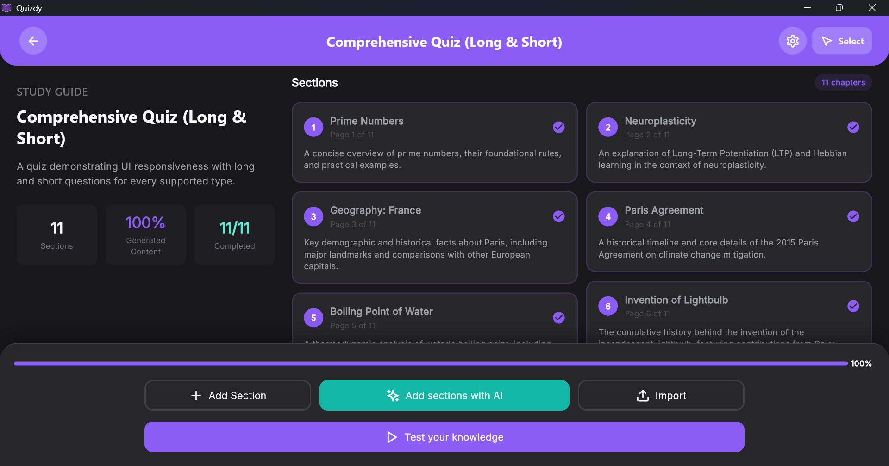
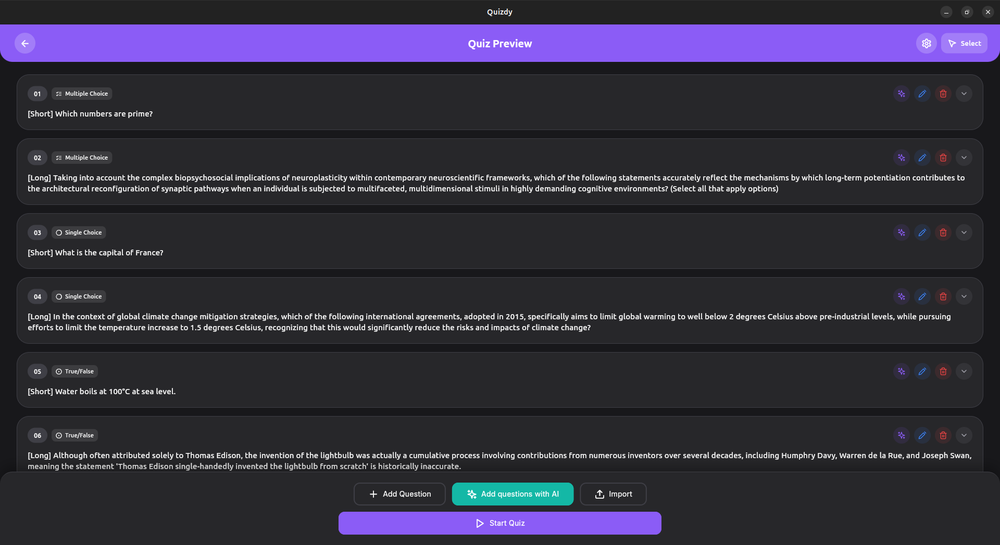

<p align="center">
  
</p>

<p align="center">
  
  
  
  
  
  
  
  
</p>

Quizdy is a cross-platform quiz and study app built with Flutter. It combines AI-powered content generation, guided study flows, and exam-ready quiz execution in a single experience across web, mobile, and desktop.

## Official Versions

- Web: [vicajilau.github.io/quizdy](https://vicajilau.github.io/quizdy/)
- Android: [Google Play Store](https://play.google.com/store/apps/details?id=es.victorcarreras.quiz_app)
- Huawei: [App Gallery](https://play.google.com/store/apps/details?id=es.victorcarreras.quiz_app)
- iOS: [App Store](https://apps.apple.com/app/quiz-appl/id6758663432)
- macOS: [Mac App Store](https://apps.apple.com/app/quiz-appl/id6758663432)
- Windows: [Microsoft Store](https://apps.microsoft.com/store/detail/9P77H0WRJSM2?cid=DevShareMCLPCS)
- Linux: [Snapcraft](https://snapcraft.io/quiz-app)

## Product Views

### Study Mode

AI-driven study UI for turning source material into guided reading, contextual explanations, and follow-up question generation.



### Quiz Mode

Practice and exam flows with focused question answering, validation, explanations, timers, and progress tracking.



## What Quizdy Does Well

- Study Mode with an AI-driven interface for exploring content chapter by chapter, asking for explanations, and deepening understanding without leaving the app.
- Practice Mode for immediate validation, feedback, and answer explanations while you work through questions.
- Exam Mode with optional time limits, randomized order, and a cleaner assessment flow.
- AI question generation from text or selected document sections using Gemini or OpenAI.
- Support for multiple question types: multiple choice, single choice, true or false, and essay.
- Cross-platform delivery on Android, iOS, macOS, Windows, Linux, and web.
- Localization in 18 languages.
- Offline quiz execution for non-AI flows.

## Core Features

| Area | Highlights |
| --- | --- |
| Study | AI study assistant, chapter-based study flow, Markdown and LaTeX support, section-aware generation |
| Quiz | Practice Mode, Exam Mode, scoring, explanations, progress tracking |
| Assessment | Exam timer, question randomization, answer randomization |
| AI | Gemini and OpenAI support, configurable models, service-aware limits |
| Authoring | Create, edit, and customize quiz files with flexible settings |
| Platform | Flutter app for web, mobile, and desktop |

## AI Features

Quizdy includes two complementary AI workflows:

- Generate questions automatically from raw text, topics, or selected sections of a document.
- Use the AI Study Assistant to ask for explanations, context, comparisons, and follow-up help while studying or answering questions.

Supported AI providers:

- Google Gemini
- OpenAI

Supported generation formats:

- Multiple choice
- Single choice
- True or false
- Essay
- Mixed generation

## Getting Started

### Requirements

- Flutter SDK 3.41.0 or higher
- Dart SDK 3.11.0 or higher
- Android Studio and/or Xcode for mobile development

### Installation

```bash
git clone https://github.com/vicajilau/quizdy.git
cd quizdy
flutter pub get
flutter run
```

### Optional AI Setup

To enable AI features, configure at least one API key inside the app:

- Gemini API key from [Google AI Studio](https://aistudio.google.com/app/apikey)
- OpenAI API key from [OpenAI Platform](https://platform.openai.com/api-keys)

## Development

```bash
flutter analyze
flutter test
flutter build apk
flutter build web
```

## Documentation

- [Application Structure](docs/APP_STRUCTURE.md)
- [AI Limits System](docs/AI_LIMITS_SYSTEM.md)
- [LaTeX Support](docs/LATEX_SUPPORT.md)

## Contributing

Contributions are welcome. For substantial changes, run the analyzer and test suite before opening a pull request.

## License

This project is licensed under the GPL-3.0-or-later License. See [LICENSE](LICENSE) for details.
