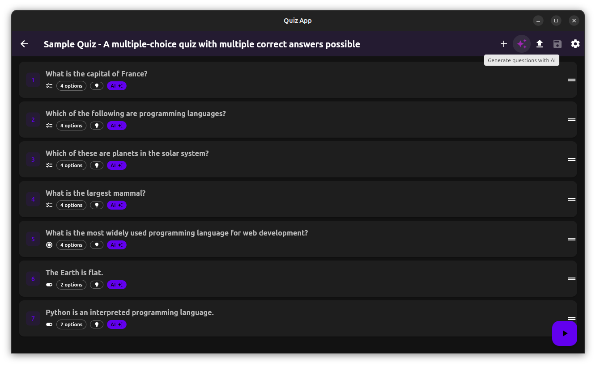

<p align="center">
  

<p align="center">
  
  
</p>

A cross-platform Flutter application that provides an interactive and engaging quiz experience with customizable questions, real-time scoring, and beautiful animations.



_The app provides an intuitive interface for taking quizzes with smooth animations, real-time feedback, and comprehensive score tracking, as shown above._

## Features

- **Cross-platform compatibility**: Built with Flutter to run seamlessly on iOS, Android, web, and desktop
- **Multiple question types**: Support for multiple choice, true/false, and customizable question formats
- **Real-time scoring**: Instant feedback and score calculation during quiz sessions
- **Beautiful UI/UX**: Modern Material Design with smooth animations and responsive layouts
- **Quiz customization**: Create and customize your own quizzes with flexible question configurations
- **Progress tracking**: Track performance across multiple quiz sessions with detailed analytics
- **Offline support**: Take quizzes without internet connection
- **Adaptive difficulty**: Questions can adapt based on user performance

## App Structure

### Quiz Configuration

The app supports flexible quiz configurations through JSON structure:

```dart
class Quiz {
  final String title;
  final String description;
  final List<Question> questions;
  final QuizSettings settings;
}
```

### Question Types

#### Multiple Choice Questions

```dart
class MultipleChoiceQuestion extends Question {
  final String text;
  final List<String> options;
  final List<int> correctAnswers;
  final int points;
  final String? explanation;
}
```

#### True/False Questions

```dart
class TrueFalseQuestion extends Question {
  final String text;
  final bool correctAnswer;
  final int points;
  final String? explanation;
}
```

## Requirements

- Flutter SDK 3.0.0 or higher
- Dart SDK 3.0.0 or higher
- Android Studio / Xcode for mobile development
- A device or emulator for testing

## Installation

1. **Clone this repository**

   ```bash
   git clone https://github.com/vicajilau/quiz_app.git
   cd quiz_app
   ```

2. **Install dependencies**

   ```bash
   flutter pub get
   ```

3. **Run the app**

   ```bash
   flutter run
   ```

4. **Build for production**
   - **Android**: `flutter build apk --release`
   - **iOS**: `flutter build ios --release`
   - **Web**: `flutter build web --release`

## Development and Commands

### Main Commands

- `flutter run`: Run the app in development mode
- `flutter run --release`: Run the app in release mode
- `flutter test`: Run unit and widget tests
- `flutter build apk`: Build Android APK
- `flutter build ios`: Build iOS app
- `flutter build web`: Build web version

### Development Workflow

1. **During active development:**

   ```bash
   flutter run --hot-reload
   ```

   This enables hot reload for instant code changes.

2. **To test changes:**

   - Save your changes and see instant updates with hot reload
   - Use `r` to hot reload, `R` to hot restart

3. **Before committing:**

   ```bash
   flutter analyze          # Check for any issues
   flutter test            # Run all tests
   flutter build apk --release  # Verify release build works
   ```

4. **To create a new version:**

   ```bash
   # 1. Update version in pubspec.yaml
   # 2. Run tests to ensure quality
   flutter test

   # 3. Build release versions
   flutter build apk --release
   flutter build ios --release

   # 4. Test on physical devices
   ```

### Testing

The app includes comprehensive testing to ensure quiz functionality:

- **Unit tests**: Core business logic and quiz mechanics
- **Widget tests**: UI components and user interactions
- **Integration tests**: End-to-end quiz flow testing
- **Performance tests**: App responsiveness and memory usage

```bash
# Run all tests
flutter test

# Run tests with coverage
flutter test --coverage

# Run specific test file
flutter test test/quiz_logic_test.dart

# Run integration tests
flutter test integration_test/
```

### Quiz Logic Validation

The app validates:

- **Quiz structure**:

  - Valid question types and formats
  - Correct answer validation
  - Score calculation accuracy
  - Time tracking functionality

- **User interactions**:

  - Answer selection and submission
  - Navigation between questions
  - Quiz completion flow
  - Result calculation and display

- **Data persistence**: Progress saving and quiz history

### Extensible Architecture

The app is designed to easily support new question types and features:

```dart
// Currently supported
enum QuestionType {
  multipleChoice,
  trueFalse,
}

// Future support planned
enum QuestionType {
  multipleChoice,
  trueFalse,
  fillInBlank,
  essay,
  matching,
  dragAndDrop,
}
```

### Project Structure

```
quiz_app/
├── .github/
│   └── assets/              # Demo images and assets
│       ├── demo.png        # Demo screenshots
│       └── quiz.png        # App icon
├── lib/
│   ├── main.dart           # App entry point
│   ├── core/               # Core utilities and constants
│   │   ├── service_locator.dart
│   │   ├── color_manager.dart
│   │   └── constants/
│   ├── data/               # Data layer
│   │   ├── repositories/
│   │   └── services/
│   ├── domain/             # Business logic
│   │   ├── models/
│   │   └── use_cases/
│   ├── presentation/       # UI layer
│   │   ├── pages/
│   │   ├── widgets/
│   │   └── providers/
│   └── routes/             # Navigation
├── test/                   # Unit and widget tests
├── integration_test/       # Integration tests
├── android/               # Android-specific code
├── ios/                   # iOS-specific code
├── web/                   # Web-specific code
├── pubspec.yaml           # Dependencies
└── README.md
```

## Contributing

Contributions are welcome! Please follow these steps:

### To Contribute

1. **Fork the repository**
2. **Create a branch for your feature:**

   ```bash
   git checkout -b feature/new-question-type
   ```

3. **Make changes and test:**

   ```bash
   flutter analyze        # Check for any issues
   flutter test          # Verify tests pass
   ```

4. **Test the app:**

   ```bash
   # Test on different platforms
   flutter run -d android
   flutter run -d ios
   flutter run -d chrome
   ```

5. **Commit and push:**

   ```bash
   git add .
   git commit -m "feat: add drag and drop question type support"
   git push origin feature/new-question-type
   ```

6. **Create Pull Request**

### Conventions

- **Commits**: Use [Conventional Commits](https://www.conventionalcommits.org/)

  - `feat:` for new features (e.g., new question types, UI improvements)
  - `fix:` for bug fixes
  - `docs:` for documentation changes
  - `refactor:` for code refactoring
  - `test:` for adding or modifying tests

- **Code**:
  - Follow Flutter/Dart style guidelines
  - Use meaningful variable and function names
  - Add comments for complex logic
  - Ensure responsive design for different screen sizes
  - Update tests when adding new features

### Adding New Question Types

To add a new question type:

1. **Create the question model** (`lib/domain/models/`)
2. **Add question type enum** (`lib/core/constants/`)
3. **Implement UI widgets** (`lib/presentation/widgets/`)
4. **Add business logic** (`lib/domain/use_cases/`)
5. **Update repositories** (`lib/data/repositories/`)
6. **Add tests** for the new functionality

### Reporting Issues

If you find a bug or have a suggestion:

1. **Check** that a similar issue doesn't already exist
2. **Create a new issue** with:
   - Clear description of the problem
   - Steps to reproduce
   - Screenshots if applicable
   - Device information (OS, Flutter version)
   - Expected vs actual behavior

## License

This project is under the MIT license.
